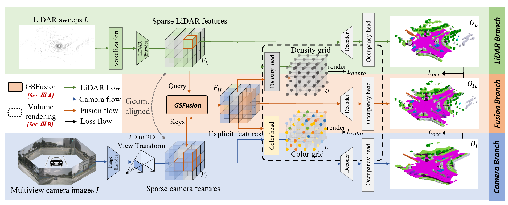

# Co-Occ: Coupling Explicit Feature Fusion with Volume Rendering Regularization for Multi-Modal 3D Semantic Occupancy Prediction

### [Project Page](https://rorisis.github.io/Co-Occ_project-page/) | [Paper](https://ieeexplore.ieee.org/document/10517470) | [Arxiv](https://arxiv.org/abs/2404.04561) 

## Introduction
3D semantic occupancy prediction is a pivotal task in the field of autonomous driving. Recent approaches have made great advances in 3D semantic occupancy predictions on a single modality. However, multi-modal semantic occupancy prediction approaches have encountered difficulties in dealing with the modality heterogeneity, modality misalignment, and insufficient modality interactions that arise during the fusion of different modalities data, which may result in the loss of important geometric and semantic information. This letter presents a novel multi-modal, i.e., LiDAR-camera 3D semantic occupancy prediction framework, dubbed Co-Occ, which couples explicit LiDAR-camera feature fusion with implicit volume rendering regularization. The key insight is that volume rendering in the feature space can proficiently bridge the gap between 3D LiDAR sweeps and 2D images while serving as a physical regularization to enhance LiDAR-camera fused volumetric representation. Specifically, we first propose a Geometric- and Semantic-aware Fusion (GSFusion) module to explicitly enhance LiDAR features by incorporating neighboring camera features through a K-nearest neighbors (KNN) search. Then, we employ volume rendering to project the fused feature back to the image planes for reconstructing color and depth maps. These maps are then supervised by input images from the camera and depth estimations derived from LiDAR, respectively. Extensive experiments on the popular nuScenes and SemanticKITTI benchmarks verify the effectiveness of our Co-Occ for 3D semantic occupancy prediction.



## News

- **[2024/05/21]** Codes release.

## Demo

### nuScenes:


## Getting Started

[1] Check [installation](docs/install.md) for installation. Our code is mainly based on mmdetection3d.

[2] Check [data_preparation](docs/prepare_dataset.md) for preparing nuScenes datasets.

[3] Check [train_and_eval](docs/train_and_eval.md) for training and evaluation.

[4] Check [predict_and_visualize](docs/predict_and_visualize.md) for prediction and visualization.


## Model Weights
We provide the [pretrained weights](https://drive.google.com/drive/folders/1-C68XFHSseRTd1V54mNc3pLzDGFfsnY1) on nuScenes datasets with occupancy labels (resolution 200x200x16 with voxel size 0.5m) from [here](https://github.com/weiyithu/SurroundOcc/blob/main/docs/data.md), reproduced with the released codebase.
| Modality | Backbone | Model Weights|
|:----:|:----:|:----:|
| [Camera-only](projects/configs/coocc_nusc/coocc_cam_r101_896x1600.py) | ResNet101 | [nusc_cam_r101_896x1600.pth](https://drive.google.com/drive/folders/1-C68XFHSseRTd1V54mNc3pLzDGFfsnY1) | 
| [LiDAR-only](/projects/configs/coocc_nusc/coocc_lidar.py) | - | [nusc_lidar.pth](https://drive.google.com/drive/folders/1-C68XFHSseRTd1V54mNc3pLzDGFfsnY1) |
| [LiDAR-camera](projects/configs/coocc_nusc/coocc_multi_r101_896x1600.py) | ResNet101 | [nusc_multi_r101_896x1600.pth](https://drive.google.com/drive/folders/1-C68XFHSseRTd1V54mNc3pLzDGFfsnY1) |
| [LiDAR-camera](projects/configs/coocc_nusc/coocc_multi_r50_256x704.py) | ResNet50 | [nusc_multi_r50_256x704.pth](https://drive.google.com/drive/folders/1-C68XFHSseRTd1V54mNc3pLzDGFfsnY1) | 

For nuscenes-openoccupancy benchmark, we provide the [pretrained weight](https://pan.baidu.com/s/1FxJSdpiZxveUcHDfLJ4-QA?pwd=cooc) (password: cooc) with this [config file](https://github.com/Rorisis/Co-Occ/blob/main/projects/configs/coocc_nusc/coocc_multi_r101_openoccupancy.py).

## Acknowledgement

This project is developed based on the following open-sourced projects: [OccFormer](https://github.com/zhangyp15/OccFormer/tree/main), [SurroundOcc](https://github.com/weiyithu/SurroundOcc), [OpenOccupancy](https://github.com/JeffWang987/OpenOccupancy/tree/main), [MonoScene](https://github.com/astra-vision/MonoScene), [BEVDet](https://github.com/HuangJunJie2017/BEVDet), [BEVFormer](https://github.com/fundamentalvision/BEVFormer). Thanks for their excellent work.

## Citation

If you find this project helpful, please consider giving this repo a star or citing the following paper:
```
@article{pan2024co,
  title={Co-Occ: Coupling Explicit Feature Fusion With Volume Rendering Regularization for Multi-Modal 3D Semantic Occupancy Prediction},
  author={Pan, Jingyi and Wang, Zipeng and Wang, Lin},
  journal={IEEE Robotics and Automation Letters},
  year={2024},
  publisher={IEEE}
}
```

